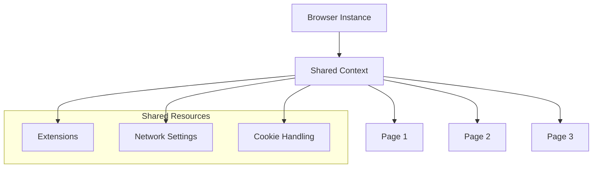

# Browser Context Architecture

Pixashot's single browser context architecture is a key differentiator that provides significant performance and resource benefits. This guide explains how it works, its benefits, and important considerations for deployment.

## Overview

Traditional screenshot services create a new browser instance for each request, which can be resource-intensive and slow. Pixashot instead maintains a single browser context that's shared across all requests:



## Implementation

The context management is handled by the `ContextManager` class:

```python
class ContextManager:
    def __init__(self):
        self.context = None
        self.browser = None
        self.use_popup_blocker = os.getenv('USE_POPUP_BLOCKER', 'true').lower() == 'true'
        self.use_cookie_blocker = os.getenv('USE_COOKIE_BLOCKER', 'true').lower() == 'true'
        self.default_proxy_config = self._get_proxy_config()
```

### Context Initialization

Context initialization occurs once during service startup:

```python
async def initialize(self, playwright):
    """Initialize and return a configured browser context."""
    try:
        # Base browser arguments
        browser_args = [
            '--disable-features=site-per-process',
            '--no-sandbox',
            '--disable-setuid-sandbox',
            '--disable-dev-shm-usage',
        ]

        # Add extension arguments
        extension_args = self._get_extension_args()
        if extension_args:
            browser_args.extend(extension_args)

        self.browser = await playwright.chromium.launch(args=browser_args)
        self.context = await self.browser.new_context(**context_options)
        return self.context

    except Exception as e:
        raise BrowserException(f"Browser context initialization failed: {str(e)}")
```

## Key Features

### Extension Management

Extensions are loaded once and shared across all requests:

```python
def _get_extension_args(self):
    """Get browser arguments for enabled extensions."""
    extensions = []
    extension_configs = [
        ('popup-off', self.use_popup_blocker),
        ('dont-care-cookies', self.use_cookie_blocker)
    ]

    for ext_name, is_enabled in extension_configs:
        if is_enabled:
            ext_path = os.path.join(self.extension_dir, ext_name)
            if os.path.exists(ext_path):
                extensions.append(ext_path)

    return [
        f'--disable-extensions-except={",".join(extensions)}',
        *[f'--load-extension={ext}' for ext in extensions]
    ]
```

### Resource Sharing

Resources are efficiently shared across all requests:
- Browser process
- Network connections
- Memory allocations
- Extension states
- Cookie handling

### Page Lifecycle

Individual pages are created and destroyed for each request while maintaining the shared context:

```python
async def capture_screenshot(self, output_path, options):
    """Capture screenshot using the configured controllers."""
    try:
        page = await self.context.new_page()
        try:
            await self._configure_page(page, options)
            # ... capture logic ...
        finally:
            await page.close()
    except Exception as e:
        raise ScreenshotServiceException(str(e))
```

## Benefits

### Performance
- **Faster Response Times**: No browser startup overhead
- **Resource Efficiency**: Shared memory and CPU usage
- **Connection Reuse**: Network connections are maintained
- **Cache Utilization**: Browser cache is shared

### Reliability
- **Consistent Behavior**: Same context for all requests
- **Predictable Resource Usage**: Better memory management
- **Stable Extensions**: Extensions remain loaded
- **Error Isolation**: Page failures don't affect context

### Scalability
- **Lower Memory Footprint**: Single browser instance
- **Efficient Resource Usage**: Shared context reduces overhead
- **Better CPU Utilization**: No repeated browser initialization
- **Optimized Network Usage**: Connection pooling

## Configuration Options

### Memory Management

Configure worker processes and request limits:

```bash
# Environment variables
WORKERS=4                  # Number of worker processes
MAX_REQUESTS=1000         # Requests per worker before restart
KEEP_ALIVE=300           # Keep-alive timeout in seconds
```

### Extension Control

Enable or disable built-in extensions:

```bash
# Extension configuration
USE_POPUP_BLOCKER=true   # Enable popup blocking
USE_COOKIE_BLOCKER=true  # Enable cookie consent handling
```

### Network Settings

Configure proxy and network behavior:

```bash
# Proxy configuration
PROXY_SERVER="proxy.example.com"
PROXY_PORT="8080"
PROXY_USERNAME="user"
PROXY_PASSWORD="pass"
```

## Important Considerations

### Security

1. **Isolation**
    - Pages are isolated from each other
    - Resources are cleaned up after each request
    - Authentication tokens aren't shared

2. **Resource Protection**
    - Memory limits per page
    - Timeout controls
    - Automatic cleanup

### Limitations

1. **Extension Configuration**
    - Extensions are server-wide
    - Can't change per request
    - Must be set at startup

2. **Resource Sharing**
    - Memory is shared
    - CPU is shared
    - Network connections are shared

### Best Practices

1. **Resource Configuration**
   ```bash
   # Recommended settings for production
   WORKERS=4              # Adjust based on CPU cores
   MAX_REQUESTS=1000     # Prevent memory leaks
   KEEP_ALIVE=300        # Balance between reuse and cleanup
   ```

2. **Memory Management**
    - Monitor memory usage
    - Set appropriate limits
    - Implement cleanup routines

3. **Extension Usage**
    - Enable only needed extensions
    - Monitor extension performance
    - Update extensions regularly

## Monitoring

### Health Checks

Monitor context health:

```bash
# Check health endpoint
curl http://your-instance/health

# Check detailed status
curl http://your-instance/health/ready
```

### Resource Metrics

Track important metrics:
- Memory usage
- CPU utilization
- Request latency
- Error rates

## Troubleshooting

Common issues and solutions:

1. **High Memory Usage**
    - Check MAX_REQUESTS setting
    - Monitor worker processes
    - Review page cleanup

2. **Context Errors**
    - Check browser logs
    - Verify extension status
    - Monitor network connectivity

3. **Performance Issues**
    - Review worker configuration
    - Check resource limits
    - Monitor network conditions

## Next Steps

- Learn about the [Request Lifecycle](request-lifecycle.md)
- Understand [Resource Management](resource-management.md)
- Explore [Performance Optimization](../deployment/scaling.md)

The single browser context architecture is fundamental to Pixashot's performance and reliability. Understanding its behavior and configuration options is crucial for optimal deployment and operation.