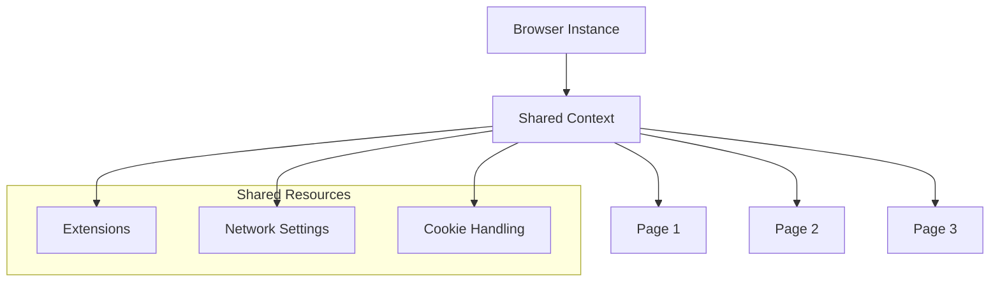

# Browser Context Architecture

Pixashot's single browser context architecture is a key differentiator that provides significant performance and resource benefits. This guide explains how it works, its benefits, and important considerations for deployment.

## Overview

Traditional screenshot services create a new browser instance for each request, which can be resource-intensive and slow. Pixashot instead maintains a single browser context that's shared across all requests:



## Implementation

The context management is handled by the `ContextManager` class, defined in [`context_manager.py`](https://github.com/pixashot/pixashot/blob/develop/src/context_manager.py):

```python
class ContextManager:
    def __init__(self):
        self.context = None
        self.browser = None
        self.use_popup_blocker = os.getenv('USE_POPUP_BLOCKER', 'true').lower() == 'true'
        self.use_cookie_blocker = os.getenv('USE_COOKIE_BLOCKER', 'true').lower() == 'true'
        self.default_proxy_config = self._get_proxy_config()
```

### Context Initialization

Context initialization occurs once during service startup. The `initialize` method in
`ContextManager` sets up the browser with optimized arguments and any enabled extensions:

```python
async def initialize(self, playwright):
    """Initialize and return a configured browser context."""
    try:
        # Base browser arguments
        browser_args = [
            '--disable-features=site-per-process',
            '--no-sandbox',
            '--disable-setuid-sandbox',
            '--disable-dev-shm-usage',
        ]

        # Add extension arguments
        extension_args = self._get_extension_args()
        if extension_args:
            browser_args.extend(extension_args)

        self.browser = await playwright.chromium.launch(args=browser_args)
        self.context = await self.browser.new_context(**context_options)
        return self.context

    except Exception as e:
        raise BrowserException(f"Browser context initialization failed: {str(e)}")
```

## Key Features

### Extension Management

Extensions are loaded once and shared across all requests. The `_get_extension_args` method determines which extensions to load based on environment variables:

```python
def _get_extension_args(self):
    """Get browser arguments for enabled extensions."""
    extensions = []
    extension_configs = [
        ('popup-off', self.use_popup_blocker),
        ('dont-care-cookies', self.use_cookie_blocker)
    ]

    for ext_name, is_enabled in extension_configs:
        if is_enabled:
            ext_path = os.path.join(self.extension_dir, ext_name)
            if os.path.exists(ext_path):
                extensions.append(ext_path)

    return [
        f'--disable-extensions-except={",".join(extensions)}',
        *[f'--load-extension={ext}' for ext in extensions]
    ]
```

### Resource Sharing

Resources are efficiently shared across all requests:

- Browser process
- Network connections
- Memory allocations
- Extension states
- Cookie handling

### Page Lifecycle

Individual pages are created and destroyed for each request while maintaining the shared context. The `capture_screenshot` method in `CaptureService` demonstrates this:

```python
async def capture_screenshot(self, output_path, options):
    """Capture screenshot using the configured controllers."""
    try:
        page = await self.context.new_page()
        try:
            await self._configure_page(page, options)
            # ... capture logic ...
        finally:
            await page.close()
    except Exception as e:
        raise ScreenshotServiceException(str(e))
```

## Benefits

### Performance

- **Faster Response Times**: No browser startup overhead for each request.
- **Resource Efficiency**: Shared memory and CPU usage across requests.
- **Connection Reuse**: Network connections are maintained and reused.
- **Cache Utilization**: Browser cache is shared, improving load times for repeated assets.

### Reliability

- **Consistent Behavior**: All requests use the same browser context, ensuring consistent settings and behavior.
- **Predictable Resource Usage**: Easier to manage and predict memory usage with a single browser instance.
- **Stable Extensions
  **: Extensions are loaded once and remain active, reducing initialization overhead and potential issues.
- **Error Isolation**: While the context is shared, individual page failures do not affect the overall context.

### Scalability

- **Lower Memory Footprint**: A single browser instance consumes less memory than multiple instances.
- **Efficient Resource Usage**: Shared context reduces overhead and improves resource utilization.
- **Better CPU Utilization**: Reduces CPU load by eliminating repeated browser initializations.
- **Optimized Network Usage**: Connection pooling optimizes network resource usage.

## Configuration Options

### Memory Management

Worker processes and request limits can be configured via environment variables to optimize memory usage:

```bash
# Environment variables
WORKERS=4                  # Number of worker processes
MAX_REQUESTS=1000         # Requests per worker before restart
KEEP_ALIVE=300           # Keep-alive timeout in seconds
```

### Extension Control

Built-in extensions can be enabled or disabled via environment variables:

```bash
# Extension configuration
USE_POPUP_BLOCKER=true   # Enable popup blocking
USE_COOKIE_BLOCKER=true  # Enable cookie consent handling
```

### Network Settings

Proxy settings can be configured to control network behavior:

```bash
# Proxy configuration
PROXY_SERVER="proxy.example.com"
PROXY_PORT="8080"
PROXY_USERNAME="user"
PROXY_PASSWORD="pass"
```

## Important Considerations

### Security

1. **Isolation**:

- Each page operates in isolation within the shared context.
- Resources are cleaned up after each request to prevent data leakage.
- Authentication tokens should not be shared or stored in a way that they persist across different users' requests.

2. **Resource Protection**:

- Memory limits are enforced at the container level (e.g., via Docker or Cloud Run settings).
- Timeouts are used to prevent individual requests from consuming too many resources.
- Automatic cleanup routines are in place to release resources.

### Limitations

1. **Extension Configuration**:

- Extensions are configured globally for the server.
- They cannot be changed per request.
- Configuration must be set at startup.

2. **Resource Sharing**:

- While resources are shared efficiently, excessive usage by one request can potentially impact others.
- Monitoring is crucial to ensure fair resource allocation.

### Best Practices

1. **Resource Configuration**:

   ```bash
   # Recommended settings for production
   WORKERS=4              # Adjust based on CPU cores and expected load
   MAX_REQUESTS=1000     # Helps prevent memory leaks by recycling workers
   KEEP_ALIVE=300        # Balance between connection reuse and cleanup
   ```

2. **Memory Management**:

- Monitor memory usage through the `/health` endpoint.
- Set appropriate memory limits for your deployment environment (e.g., Docker
  `--memory` flag, Cloud Run memory settings).
- Implement cleanup routines to release resources after each request.

3. **Extension Usage**:

- Enable only necessary extensions to minimize overhead.
- Monitor the performance impact of each enabled extension.

## Monitoring

### Health Checks

Monitor context health using the provided endpoints:

```bash
# Check health endpoint
curl http://your-instance/health

# Check detailed status
curl http://your-instance/health/ready
```

### Resource Metrics

Track important metrics:

- Memory usage
- CPU utilization
- Request latency
- Error rates

These metrics can be monitored through the
`/health` endpoint or by integrating with monitoring systems like Prometheus or Google Cloud Monitoring.

## Troubleshooting

Common issues and solutions:

1. **High Memory Usage**:

- Check the `MAX_REQUESTS` setting to ensure workers are recycled.
- Monitor memory usage and adjust `WORKERS` accordingly.
- Review page cleanup logic in `capture_service.py` to ensure resources are released.

2. **Context Errors**:

- Check browser logs for errors related to context initialization or extension loading.
- Verify that environment variables related to extensions are correctly set.

3. **Performance Issues**:

- Review worker configuration and adjust based on load.
- Check resource limits (CPU, memory) in your deployment environment.
- Monitor network conditions and proxy settings if applicable.

## Next Steps

- Learn about the [Request Lifecycle](request-lifecycle.md) to understand how requests are processed.
- Understand [Resource Management](resource-management.md) for more details on memory and CPU optimization.
- Explore [Performance Optimization](../deployment/scaling.md) for scaling your deployment.

The single browser context architecture is fundamental to Pixashot's performance and reliability. Understanding its behavior and configuration options is crucial for optimal deployment and operation. By leveraging this architecture, Pixashot provides efficient resource utilization, faster response times, and consistent capture behavior, making it a powerful solution for web screenshot needs.