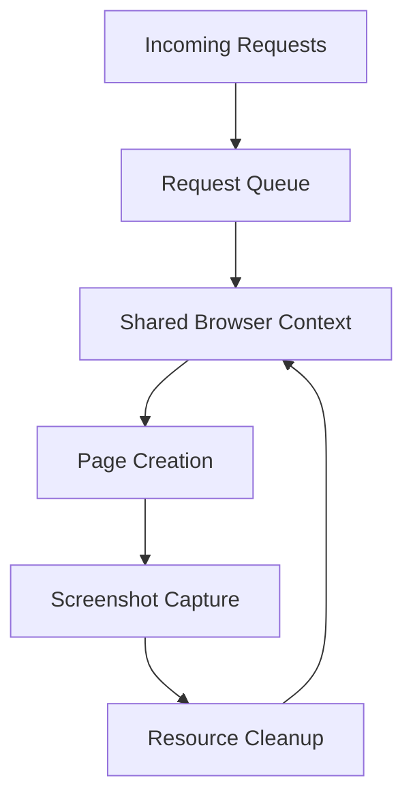

# Core Concepts

Understanding how Pixashot works internally is crucial for effective deployment, troubleshooting, and optimization. This guide explores Pixashot's architecture and core principles that make it efficient and reliable.

## Single-Context Architecture

At the heart of Pixashot is its single-context browser architecture. Unlike traditional screenshot services that create new browser instances for each request, Pixashot maintains a single, shared browser context across all requests:



### Key Benefits
- **Efficient Resource Usage**: Memory and CPU resources are shared effectively
- **Faster Response Times**: No cold-start overhead for browser initialization
- **Consistent Behavior**: Extensions and settings apply uniformly
- **Better Resource Control**: Simplified monitoring and management

## Component Overview

Pixashot consists of several key components working together:

1. **Context Manager**
    - Manages the shared browser context
    - Handles browser extensions
    - Controls resource allocation
    - Manages proxy configuration

2. **Capture Service**
    - Coordinates screenshot capture
    - Manages page lifecycle
    - Handles format conversion
    - Implements retry logic

3. **Controllers**
    - **Main Controller**: Orchestrates the capture process
    - **Screenshot Controller**: Handles screenshot specifics
    - **Interaction Controller**: Manages page interactions
    - **Content Controller**: Handles content manipulation

## Request Processing Flow

When a request arrives, it goes through several stages:

1. **Request Validation**
   ```python
   # Example request validation
   class CaptureRequest(BaseModel):
       url: Optional[HttpUrl]
       html_content: Optional[str]
       format: Literal["png", "jpeg", "webp", "pdf", "html"]
       # ... additional validation rules
   ```

2. **Context Preparation**
    - Page creation within shared context
    - User agent configuration
    - Proxy setup if required
    - Extension application

3. **Content Loading**
    - URL navigation or HTML content rendering
    - Wait for network conditions
    - Dynamic content handling
    - Custom JavaScript execution

4. **Capture Process**
    - Viewport configuration
    - Screenshot capture
    - Format processing
    - Resource cleanup

## Resource Management

Pixashot implements several strategies for efficient resource management:

### Memory Management
```python
# Worker configuration example
WORKERS = int(os.getenv('WORKERS', 4))
MAX_REQUESTS = int(os.getenv('MAX_REQUESTS', 1000))
KEEP_ALIVE = int(os.getenv('KEEP_ALIVE', 300))
```

- Worker process recycling
- Memory limit enforcement
- Automatic cleanup procedures
- Resource monitoring

### Browser Resources
- Single browser instance
- Shared context pool
- Page lifecycle management
- Extension resource sharing

## Extension Management

Pixashot manages browser extensions centrally:

```python
# Extension configuration
USE_POPUP_BLOCKER = os.getenv('USE_POPUP_BLOCKER', 'true').lower() == 'true'
USE_COOKIE_BLOCKER = os.getenv('USE_COOKIE_BLOCKER', 'true').lower() == 'true'
```

Extensions are:
- Loaded once at startup
- Shared across all requests
- Configured via environment variables
- Managed efficiently in memory

## Error Handling

Robust error handling is implemented at multiple levels:

1. **Request Level**
    - Input validation
    - Authentication checks
    - Rate limiting

2. **Browser Level**
    - Navigation timeouts
    - Resource limits
    - Network errors

3. **System Level**
    - Process monitoring
    - Memory management
    - Resource cleanup

## Next Steps

To dive deeper into these concepts, explore:

- [Browser Context](browser-context.md): Detailed examination of the shared browser context
- [Request Lifecycle](request-lifecycle.md): Complete request processing flow
- [Resource Management](resource-management.md): In-depth resource handling strategies

Understanding these core concepts will help you:
- Deploy Pixashot effectively
- Troubleshoot issues efficiently
- Optimize performance
- Scale your deployment appropriately
- Integrate with your applications successfully

## Looking Forward

Future sections will build on these core concepts to explain:
- Advanced capture options
- Interaction systems
- Deployment strategies
- Security considerations
- Performance optimization

Keep these core concepts in mind as you explore the rest of the documentation, as they inform many of the design decisions and best practices throughout the system.