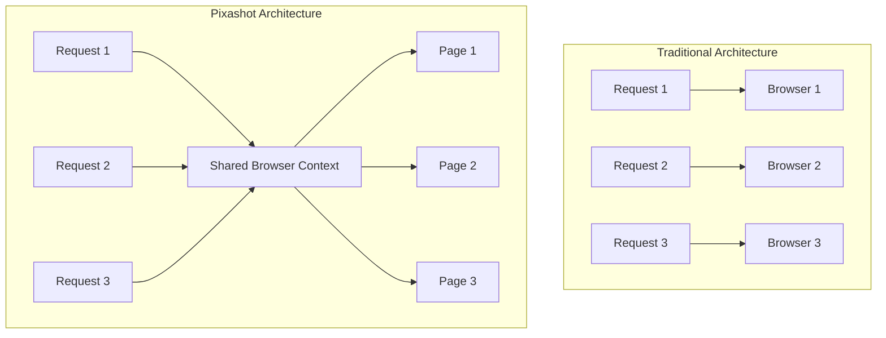
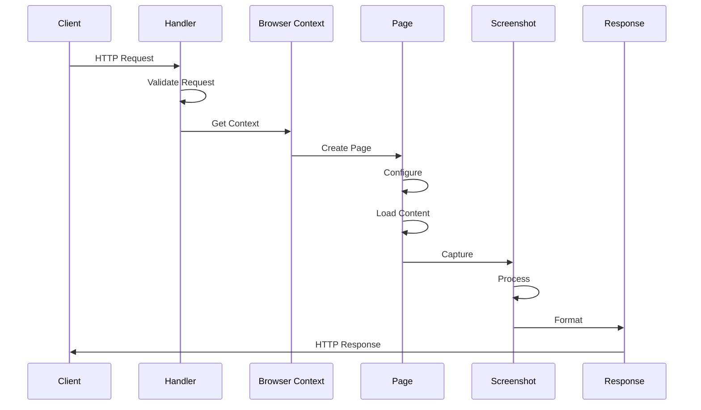
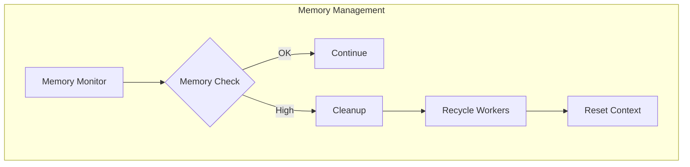
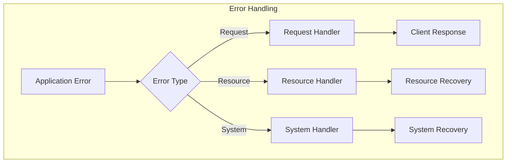

# Core Concepts

## Architecture Overview

Pixashot's architecture is built around a single-context model that maximizes performance and resource efficiency. Here's how the system fits together:


## Single-Context Architecture

Unlike traditional screenshot services that create new browser instances per request, Pixashot uses a shared context model:



### Benefits
1. **Resource Efficiency**
   - Shared memory pool
   - Optimized CPU usage
   - Reduced startup overhead
   - Efficient cache utilization

2. **Performance**
   - No cold starts
   - Faster response times
   - Predictable latency
   - Better scaling

3. **Consistency**
   - Uniform settings
   - Shared extensions
   - Consistent behavior
   - Simplified monitoring

## System Components

### Core Component Interaction


### Component Responsibilities

1. **Context Manager**
```python
class ContextManager:
    def __init__(self):
        self.browser = None
        self.context = None
        self.page_pool = PagePool()
        self.extension_manager = ExtensionManager()
        self.network_controller = NetworkController()

    async def initialize(self):
        """Initialize the shared browser context with optimized settings"""
        browser_args = self._get_optimized_args()
        self.browser = await playwright.chromium.launch(args=browser_args)
        self.context = await self._create_optimized_context()
```

2. **Page Controller**
```python
class PageController:
    def __init__(self, context_manager):
        self.context_manager = context_manager
        self.interaction_system = InteractionSystem()
        self.content_system = ContentSystem()

    async def prepare_page(self, options: CaptureOptions) -> Page:
        """Create and configure a new page for capture"""
        page = await self.context_manager.create_page()
        await self._configure_viewport(page, options)
        await self._setup_network_conditions(page, options)
        return page
```

3. **Capture Service**
```python
class CaptureService:
    def __init__(self):
        self.format_processor = FormatProcessor()
        self.resource_monitor = ResourceMonitor()

    async def capture(
        self,
        page: Page,
        options: CaptureOptions
    ) -> bytes:
        """Capture screenshot with optimized settings"""
        try:
            await self._prepare_capture(page, options)
            screenshot = await self._take_screenshot(page, options)
            return await self.format_processor.process(screenshot, options)
        finally:
            await self._cleanup(page)
```

## Request Lifecycle

### Request Flow Stages



### Processing Steps

1. **Request Validation**
```python
class CaptureOptions(BaseModel):
    """Comprehensive request validation"""
    url: Optional[HttpUrl] = Field(None, description="Target URL")
    html_content: Optional[str] = Field(None, description="HTML content")
    format: ImageFormat = Field("png", description="Output format")
    viewport: ViewportOptions = Field(default_factory=ViewportOptions)
    wait: WaitOptions = Field(default_factory=WaitOptions)
    network: NetworkOptions = Field(default_factory=NetworkOptions)
    
    @model_validator(mode='before')
    def validate_source(cls, values):
        """Ensure valid input source"""
        if not values.get('url') and not values.get('html_content'):
            raise ValueError('Either url or html_content required')
        return values
```

2. **Resource Management**
```python
class ResourceManager:
    """Manage system resources efficiently"""
    def __init__(self):
        self.memory_monitor = MemoryMonitor()
        self.cpu_monitor = CPUMonitor()
        self.network_monitor = NetworkMonitor()

    async def check_resources(self) -> bool:
        """Verify resource availability"""
        memory_ok = await self.memory_monitor.check()
        cpu_ok = await self.cpu_monitor.check()
        network_ok = await self.network_monitor.check()
        return all([memory_ok, cpu_ok, network_ok])
```

## Resource Management

### Memory Optimization



### Worker Configuration
```python
class WorkerConfig:
    """Worker process configuration"""
    WORKERS: int = Field(default=4)
    MAX_REQUESTS: int = Field(default=1000)
    KEEP_ALIVE: int = Field(default=300)
    
    def calculate_optimal_workers(self):
        """Calculate optimal worker count based on system resources"""
        cpu_count = os.cpu_count() or 2
        available_memory = psutil.virtual_memory().available
        return min(cpu_count * 2, available_memory // (2 * 1024 * 1024 * 1024))
```

## Error Handling

### Error Handling Layers



### Implementation
```python
class ErrorHandler:
    """Comprehensive error handling system"""
    async def handle_error(self, error: Exception) -> Response:
        if isinstance(error, RequestError):
            return await self.handle_request_error(error)
        elif isinstance(error, ResourceError):
            return await self.handle_resource_error(error)
        elif isinstance(error, SystemError):
            return await self.handle_system_error(error)
        return await self.handle_unknown_error(error)
```

## Best Practices

1. **Resource Optimization**
   - Monitor memory usage
   - Configure worker counts appropriately
   - Implement cleanup routines
   - Use appropriate timeouts

2. **Error Handling**
   - Implement comprehensive error handling
   - Use proper logging
   - Set up monitoring
   - Define recovery procedures

3. **Performance Tuning**
   - Optimize browser settings
   - Configure network conditions
   - Manage resource limits
   - Monitor system health

## Related Topics

- [Browser Context Details](browser-context.md)
- [Request Processing](request-lifecycle.md)
- [Resource Management](resource-management.md)
- [Performance Optimization](../deployment/scaling.md)
- [Error Handling](../troubleshooting/debugging.md)