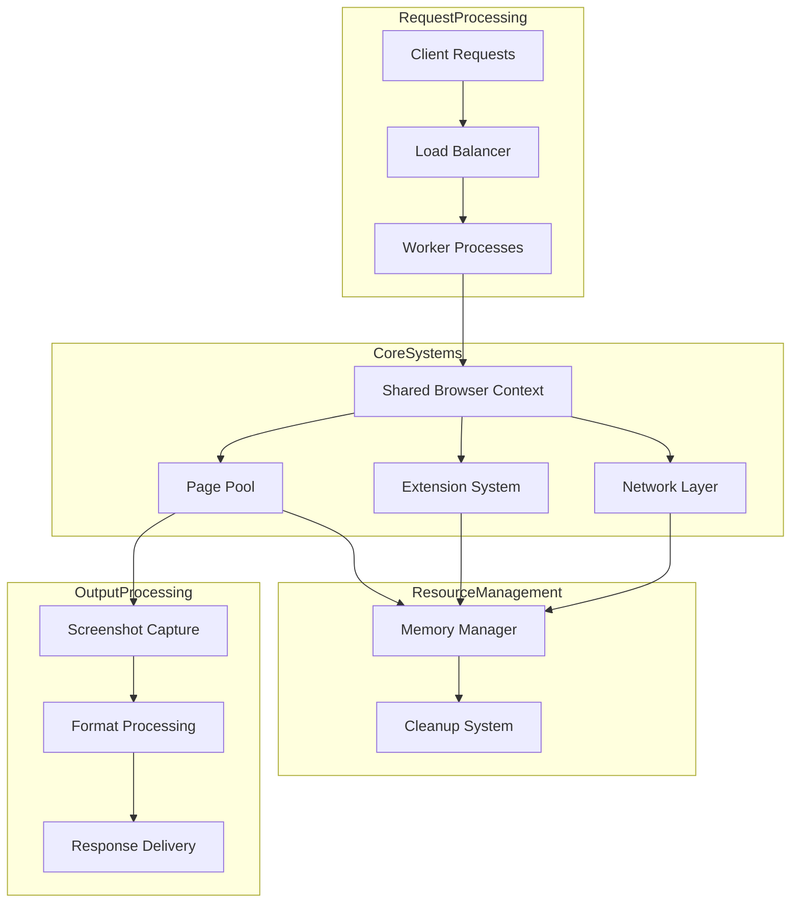
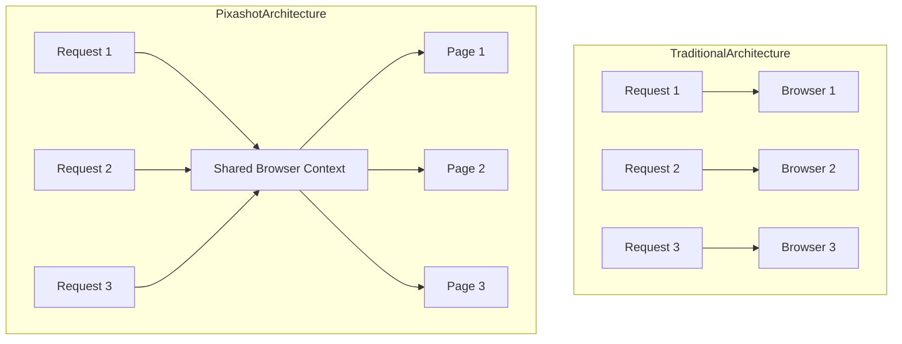
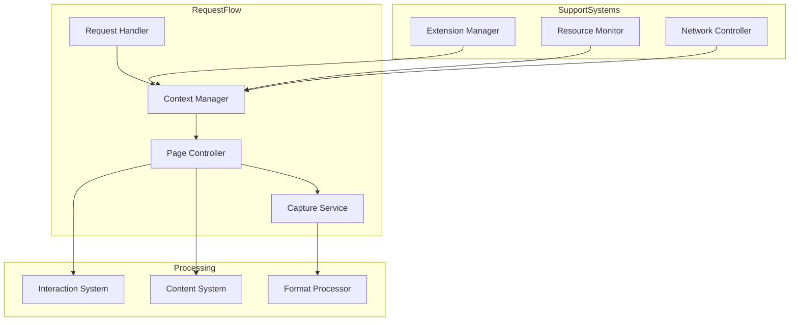
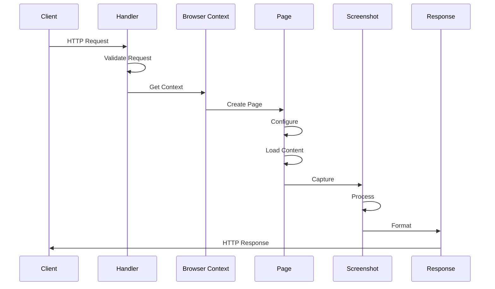
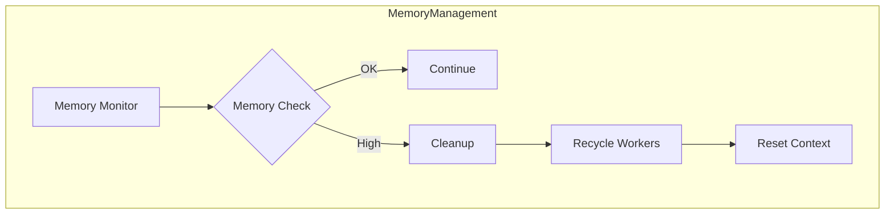
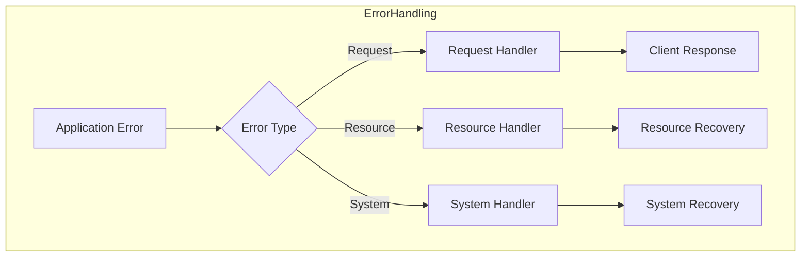

# Core Concepts

This section provides a deep dive into the fundamental architectural choices and design patterns that power Pixashot. Understanding these core concepts will help you effectively deploy, configure, and troubleshoot Pixashot, as well as contribute to its development.

## Architecture Overview

Pixashot is designed for performance and efficiency. Its architecture revolves around a **single shared browser context** model, a key differentiator from traditional screenshot services.

The diagram below illustrates the major components and their interactions:



**Key Components:**

* **Load Balancer:** Distributes incoming requests among multiple worker processes (can be a reverse-proxy such as nginx, a cloud load balancer such as those of GCP, AWS or Azure or the load balancer of your kubernetes cluster if using that to run Pixashot).
* **Worker Processes:** Handle individual capture requests, sharing a single browser context for efficiency.
* **Shared Browser Context:** The core of Pixashot's architecture, managing a single browser instance used by all workers.
* **Page Pool:** Manages the creation and reuse of browser pages within the context.
* **Extension System:** Handles the loading and configuration of browser extensions (e.g., ad blockers, cookie consent handlers).
* **Network Layer:** Manages network requests, including proxy settings and custom headers.
* **Memory Manager:** Monitors and controls memory usage, triggering worker recycling when needed.
* **Cleanup System:** Ensures proper disposal of resources after each request.
* **Screenshot Capture:** Uses Playwright's API to capture screenshots or generate PDFs.
* **Format Processing:** Handles different output formats (PNG, JPEG, WebP, PDF, HTML).
* **Response Delivery:** Sends the formatted response back to the client.

## Single-Context Architecture

Unlike traditional screenshot services that often create a new browser instance for each request, Pixashot uses a **shared context model**. This design offers significant advantages:



**Benefits:**

1. **Resource Efficiency:**
    * **Shared Memory Pool:** Reduces overall memory footprint.
    * **Optimized CPU Usage:** Avoids repeated browser startup overhead.
    * **Efficient Cache Utilization:** Leverages the browser's cache across multiple requests.
2. **Performance:**
    * **No Cold Starts:** Eliminates browser initialization delays for each request.
    * **Faster Response Times:** Reduced overhead leads to quicker capture and response.
    * **Predictable Latency:** Consistent performance due to shared resources.
3. **Consistency:**
    * **Uniform Settings:** Ensures consistent browser settings across all captures.
    * **Shared Extensions:** Extensions are loaded once and applied to all requests.
    * **Consistent Behavior:** Reduces variability in capture results.

4. **Scalability:**
    * **Lower Memory Footprint:** A single browser instance consumes less memory than multiple instances.
    * **Efficient Resource Usage:** Shared context minimizes resource contention.
    * **Better CPU Utilization:** Reduces CPU load by eliminating repeated browser initializations.
    * **Optimized Network Usage:** Connection pooling through the shared context optimizes network resource usage.

## System Components

### Core Component Interaction

The following diagram illustrates how the core components interact during a typical screenshot capture request:



### Component Responsibilities

1. **Context Manager:**
    * Initializes and manages the shared browser context.
    * Handles browser settings, extensions, and proxy configuration.
    * Manages the pool of browser pages.

**Code Example:**

```python
# src/context_manager.py
class ContextManager:
    def __init__(self):
        # ... initialization code ...

    async def initialize(self, playwright):
        """Initialize the shared browser context."""
        # ... context setup code ...
```

[View `ContextManager` source code](https://github.com/pixashot/pixashot/blob/develop/src/context_manager.py)

2. **Page Controller:**
    * Creates and configures new pages within the browser context.
    * Prepares pages for capture (e.g., setting viewport, applying dark mode).
    * Delegates interaction tasks to the `InteractionSystem`.

**Code Example:**

```python
# src/controllers/main_controller.py
class PageController:
    # ... initialization code ...

    async def prepare_page(self, options: CaptureOptions) -> Page:
        """Create and configure a new page for capture."""
        # ... page setup code ...
```

[View `MainBrowserController` source code](https://github.com/pixashot/pixashot/blob/develop/src/controllers/main_controller.py)

3. **Capture Service:**
    * Orchestrates the screenshot capture process.
    * Handles network activity and waits for page loading.
    * Delegates to the `FormatProcessor` for output formatting.

**Code Example:**

```python
# src/capture_service.py
class CaptureService:
    # ... initialization code ...

    async def capture(self, page: Page, options: CaptureOptions) -> bytes:
        """Capture screenshot with optimized settings."""
        # ... capture logic ...
```

[View `CaptureService` source code](https://github.com/pixashot/pixashot/blob/develop/src/capture_service.py)

4. **Interaction System**
    * Performs the interactions with the webpage that were specified in the capture request. This can include clicking elements, typing text, or waiting for certain conditions to be met.

**Code Example:**

```python
# src/controllers/interaction_controller.py
class InteractionController:
    # ... initialization code ...

    async def perform_interactions(self, page: Page, interactions: list):
        """Perform requested user interactions on the page."""
        # ... interaction logic ...
```

[View `InteractionController` source code](https://github.com/pixashot/pixashot/blob/develop/src/controllers/interaction_controller.py)

## Request Lifecycle

### Request Flow Stages



### Processing Steps

1. **Request Validation:**
    * Incoming requests are parsed and validated against the `CaptureRequest` model.
    * Authentication is checked (if enabled).
    * Template is applied (if specified).

```python
# src/capture_request.py
class CaptureOptions(BaseModel):
    """Comprehensive request validation"""
    # ... field definitions ...

    @model_validator(mode='before')
    def validate_source(cls, values):
        """Ensure valid input source"""
        # ... validation logic ...
```

[View `CaptureRequest` source code](https://github.com/pixashot/pixashot/blob/develop/src/capture_request.py)

2. **Resource Management:**
    * Before creating a new page, the system checks for available resources (memory, CPU).
    * If resources are low, the system may trigger worker recycling or other cleanup tasks.

```python
# Example from a hypothetical ResourceManager
class ResourceManager:
    async def check_resources(self) -> bool:
        """Verify resource availability"""
        # ... resource check logic ...
```

## Resource Management

Pixashot implements several strategies to ensure efficient resource utilization:

### Memory Optimization



* **Worker Configuration:** The number of worker processes and the maximum requests per worker can be configured via environment variables.

```python
# Example from a hypothetical WorkerConfig class
class WorkerConfig:
    """Worker process configuration"""
    WORKERS: int = 4
    MAX_REQUESTS: int = 1000
    
    def calculate_optimal_workers(self):
        """Calculate optimal worker count based on system resources"""
        # ... logic to determine worker count ...
```

* **Monitoring:** Memory usage is tracked and exposed through the `/health` endpoint.

### Browser Context Management

- The `ContextManager` initializes the browser with optimized arguments to reduce its memory footprint.
- Extensions are managed centrally to avoid duplication.

### Network Resource Management

- Connection pooling is used to efficiently manage network connections.
- Proxy settings are configurable for optimized routing.

## Error Handling

Pixashot has a robust error-handling system to ensure graceful degradation and informative error reporting:

### Error Handling Layers



### Implementation

- Specific exception types are defined for different error scenarios (e.g., `BrowserException`, `TimeoutException`).
- Error handlers format error responses with relevant details for the client.
- Retry mechanisms are implemented for transient errors.

```python
# src/exceptions.py
class ScreenshotServiceException(Exception):
    """Base exception for the Screenshot Service"""

class BrowserException(ScreenshotServiceException):
    """Exception raised for errors in browser operations"""

# ... other exception types ...
```

[View `exceptions.py` source code](https://github.com/pixashot/pixashot/blob/develop/src/exceptions.py)

## Best Practices

1. **Resource Optimization:**
    * Monitor memory and CPU usage to fine-tune worker configuration.
    * Use appropriate timeouts to prevent hanging requests.
    * Enable media blocking (`block_media`) when visual content is not needed.
2. **Error Handling:**
    * Implement comprehensive error handling in client applications.
    * Log errors with sufficient context for debugging.
    * Monitor error rates and investigate recurring issues.
3. **Performance Tuning:**
    * Utilize caching for frequently accessed URLs.
    * Experiment with different wait strategies (`wait_for_network`, `wait_for_selector`, etc.) to optimize capture speed.

## Related Topics

* [Browser Context Details](browser-context.md): Deep dive into the single browser context architecture.
* [Request Processing](request-lifecycle.md): Detailed breakdown of the request lifecycle.
* [Resource Management](resource-management.md): Comprehensive guide to resource management.
* [Performance Optimization](../deployment/scaling.md): Strategies for maximizing performance and scaling Pixashot.
* [Error Handling](../troubleshooting/debugging.md): Techniques for debugging and resolving issues.

Understanding these core concepts is essential for deploying, operating, and extending Pixashot. They are the foundation for building a robust, efficient, and reliable screenshot service.