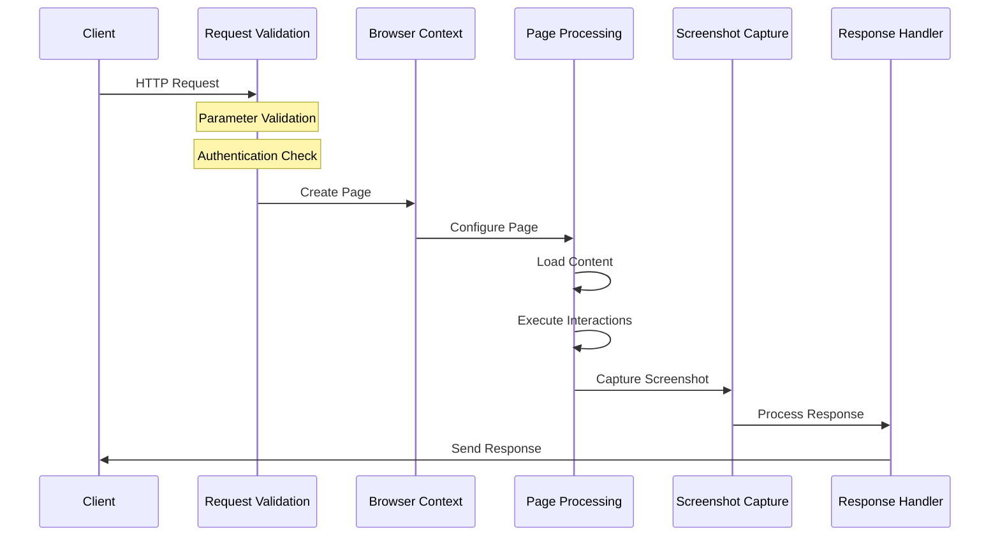

# Request Lifecycle

This guide details how Pixashot processes screenshot requests, explaining each stage from initial receipt to final response. Understanding this lifecycle is crucial for debugging, optimization, and integration development.

## Overview

The request lifecycle consists of several distinct phases:



## 1. Request Reception and Validation

### Initial Validation

Requests are first validated using Pydantic models:

```python
class CaptureRequest(BaseModel):
    url: Optional[HttpUrl] = Field(None, description="URL to capture")
    html_content: Optional[str] = Field(None, description="HTML content to render")
    format: Literal["png", "jpeg", "webp", "pdf", "html"] = "png"
    full_page: bool = False
    window_width: int = 1920
    window_height: int = 1080
    # ... additional fields

    @model_validator(mode='before')
    def validate_url_or_html_content(cls, values):
        if not values.get('url') and not values.get('html_content'):
            raise ValueError('Either url or html_content must be provided')
        if values.get('url') and values.get('html_content'):
            raise ValueError('Cannot provide both url and html_content')
        return values
```

### Authentication Check

Each request undergoes authentication verification:

```python
def verify_auth_token(auth_header):
    if not config.AUTH_TOKEN:
        return True
    
    token = auth_header.split(' ')[1] if auth_header and len(auth_header.split(' ')) > 1 else None
    return token == config.AUTH_TOKEN
```

### Template Application

If a template is specified, it's applied to the request:

```python
@model_validator(mode='before')
def apply_template(cls, values):
    template_name = values.get('template')
    if template_name:
        template = get_template(template_name)
        if template:
            for key, value in template.items():
                if key not in values or values[key] is None:
                    values[key] = value
    return values
```

## 2. Browser Context Initialization

### Page Creation

A new page is created within the shared browser context:

```python
async def capture_screenshot(self, output_path, options):
    try:
        page = await self.context.new_page()
        try:
            await self._configure_page(page, options)
            # ... capture logic ...
        finally:
            await page.close()
    except Exception as e:
        raise ScreenshotServiceException(str(e))
```

### Page Configuration

The page is configured according to request parameters:

```python
async def _configure_page(self, page: Page, options):
    """Configure page with user agent and other settings."""
    if getattr(options, 'use_random_user_agent', True):
        headers = self.context_manager._generate_headers(options)
        await page.set_extra_http_headers(headers)

    if options.geolocation:
        await self.set_geolocation(page, options.geolocation)
```

## 3. Content Loading

### URL Navigation

For URL-based requests:

```python
async def _resilient_navigation(self, page: Page, url: str, timeout: int):
    try:
        await page.goto(
            str(url),
            wait_until='domcontentloaded',
            timeout=timeout
        )
    except Exception as nav_error:
        logger.warning(f"Navigation timeout or error: {str(nav_error)}. Continuing...")
        await page.wait_for_timeout(1000)  # Additional wait time
```

### Content Preparation

Page content is prepared based on options:

```python
async def prepare_page(self, page: Page, options):
    await self.prevent_horizontal_overflow(page)
    
    if options.wait_for_network in ('idle', 'mostly_idle'):
        timeout = min(options.wait_for_timeout, 5000)
        await self.interaction_controller.wait_for_network_idle(page, timeout)

    if options.dark_mode:
        await self.apply_dark_mode(page)

    if options.wait_for_animation:
        await self.interaction_controller.wait_for_animations(page)
```

## 4. Interaction Execution

### Page Interactions

Structured interactions are executed in sequence:

```python
async def perform_interactions(self, page: Page, interactions: list):
    for step in interactions:
        try:
            if step.action == "click":
                await self._click(page, step.selector)
            elif step.action == "type":
                await self._type(page, step.selector, step.text)
            elif step.action == "hover":
                await self._hover(page, step.selector)
            elif step.action == "scroll":
                await self._scroll(page, step.x, step.y)
            elif step.action == "wait_for":
                await self._handle_wait_for(page, step.wait_for)
        except Exception as e:
            raise InteractionException(f"Failed to perform {step.action}: {str(e)}")
```

### Wait Strategies

Different wait strategies ensure content is ready:

```python
async def wait_for_network_mostly_idle(self, page: Page, timeout: int, 
                                     idle_threshold: int = 2,
                                     check_interval: int = 100):
    async def check_network_activity():
        return await page.evaluate('''() => {
            return {
                pendingRequests: window.performance.getEntriesByType('resource')
                    .filter(r => !r.responseEnd).length,
                recentRequests: window.performance.getEntriesByType('resource')
                    .filter(r => r.responseEnd > performance.now() - 1000).length
            };
        }''')
```

## 5. Screenshot Capture

### Capture Preparation

The page is prepared for capture:

```python
async def prepare_for_full_page_screenshot(self, page: Page, window_width: int):
    try:
        await page.evaluate('window.scrollTo(0, document.body.scrollHeight)')
        full_height = await page.evaluate('document.body.scrollHeight')
        full_height = min(full_height, self.MAX_VIEWPORT_HEIGHT)
        
        await page.set_viewport_size({
            'width': window_width, 
            'height': full_height
        })
        
        await page.evaluate('window.scrollTo(0, 0)')
        await page.wait_for_timeout(self.SCROLL_PAUSE_MS)
    except Exception as e:
        logger.error(f"Error in prepare_for_full_page_screenshot: {str(e)}")
```

### Screenshot Taking

The actual screenshot is captured:

```python
async def take_screenshot(self, page: Page, options: dict) -> bytes:
    screenshot_options = {
        'path': options.get('path'),
        'full_page': options.get('full_page', False),
        'type': options.get('format', 'png'),
        'quality': options.get('quality'),
        'omit_background': options.get('omit_background', False),
        'timeout': self.SCREENSHOT_TIMEOUT_MS
    }
    
    try:
        return await self._take_screenshot_with_retry(page, screenshot_options)
    except TimeoutError as e:
        logger.warning(f"Screenshot timeout: {str(e)}. Attempting fallback...")
        return await self._take_fallback_screenshot(page, screenshot_options)
```

## 6. Response Processing

### Format Handling

Responses are formatted according to request specifications:

```python
if options.response_type == 'empty':
    return '', 204
elif options.response_type == 'json':
    return jsonify({
        'file': base64.b64encode(file_data).decode('utf-8'),
        'format': options.format
    }), 200
else:  # by_format
    mime_type = 'application/pdf' if options.format == 'pdf' else f'image/{options.format}'
    response = await make_response(file_data)
    response.headers['Content-Type'] = mime_type
    response.headers['Content-Disposition'] = f'attachment; filename=screenshot.{options.format}'
    return response
```

### Resource Cleanup

Resources are properly cleaned up after each request:

```python
try:
    # Capture screenshot
    await capture_service.capture_screenshot(output_path, options)
finally:
    # Ensure cleanup
    if os.path.exists(output_path):
        os.remove(output_path)
```

## Error Handling

Errors are caught and handled at each stage:

```python
@app.errorhandler(Exception)
def handle_error(error):
    error_response = {
        'status': 'error',
        'message': 'An unexpected error occurred while capturing.',
        'timestamp': datetime.utcnow().isoformat()
    }

    if isinstance(error, ScreenshotServiceException):
        error_response.update({
            'error_type': error.__class__.__name__,
            'error_details': str(error)
        })

    return jsonify(error_response), 500
```

## Monitoring and Debugging

### Request Tracking

Each request can be tracked through its lifecycle:

```python
logger.info('Capture request', extra={
    'url': request.url,
    'client_ip': request.remote_addr,
    'user_agent': request.headers.get('User-Agent'),
    'request_id': request.headers.get('X-Request-ID')
})
```

### Performance Metrics

Key metrics are recorded:
- Request duration
- Memory usage
- Network activity
- Error rates

## Next Steps

- Learn about [Resource Management](resource-management.md)
- Explore [Advanced Features](../api-reference/request-options.md)
- Understand [Error Handling](../troubleshooting/debugging.md)

Understanding the request lifecycle is crucial for:
- Debugging issues
- Optimizing performance
- Implementing integrations
- Monitoring and logging