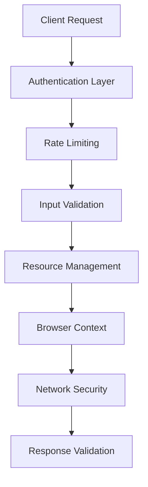

# Security Overview

Pixashot implements multiple layers of security to ensure safe and reliable screenshot capture operations. This guide outlines our security architecture and key protective measures.

## Key Security Features

### Authentication
- Token-based API authentication
- Signed URL support for temporary access
- Configurable rate limiting
- Request validation and sanitization

### Network Security
- HTTPS support for all endpoints
- Proxy configuration with authentication
- Network request filtering
- Domain and IP restrictions

### Resource Protection
- Strict memory limits per request
- Browser process isolation
- Automatic resource cleanup
- Download size restrictions

### Input Validation
- URL validation and sanitization
- Parameter type checking
- Content length limits
- File format verification

## Security Architecture



## Default Security Features

Pixashot comes with secure defaults:

- Authentication required by default
- HTTPS redirects enabled
- Secure response headers
- Resource limits enforced
- Network isolation active

## Quick Implementation Guide

1. **Set Secure Authentication**:
```bash
# Generate secure token
export AUTH_TOKEN=$(openssl rand -hex 32)
```

2. **Enable HTTPS**:
```bash
# Production configuration
export HTTPS_ONLY=true
export IGNORE_HTTPS_ERRORS=false
```

3. **Configure Rate Limits**:
```bash
# Basic rate limiting
export RATE_LIMIT_ENABLED=true
export RATE_LIMIT_CAPTURE="5 per second"
```

## Next Steps

- Set up [Authentication](authentication.md)
- Configure [Network Security](network-security.md)
- Review [Security Best Practices](best-practices.md)
- Implement [Monitoring](../deployment/monitoring.md)

## Additional Resources

- [Deployment Guide](../deployment/index.md)
- [API Reference](../api-reference/index.md)
- [Error Handling](../troubleshooting/index.md)